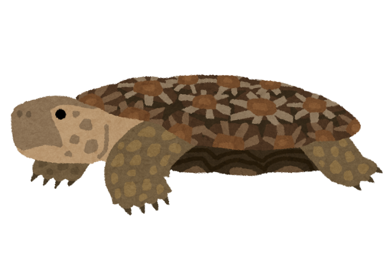

# 箇条書き
- item1
- item2
- item3
- [Ctrl]+[Shift]+[M]キー

もう一つの大見出し
===

中見出し
---

## h2タグのタイトル

### h3小見出し

###### h6まで使える

hello.  
hello. hello. hello. hello. hello. hello. hello. hello. hello. hello. hello. hello. hello. hello.

改行だけでは
改行にならない。改行前にスペース2つ以上入れると  
改行になる。

hello. hello. hello. hello. hello. hello. hello. hello. hello. hello. hello. hello. hello. hello. hello.

# 引用
> quote. quote. quote. quote. quote. quote. quote.

## 引用とは
他の著作物の一部を抜粋して、それについて述べたりすること。本文と明確に異なる書式にする。

# 区切り線

---

***

___

- - -

上に行があるとH2になってしまう
---

# 強調表現
普通 *強調* 普通

normal *kyouchou* normal

normal _kyouchou_ normal

普通**強調２**普通

normal**kyouchou2**normal

普通__強調2__普通

# 箇条書き
- item1
- item2

    段下げした状態で文を記載できる。前後に空行を入れて、4つ半角スペースを入れる。

- item3

# 連番リスト
1. 数字、ドット、スペース
2. 数字はなんでもよい
5. これでも3になる
1. よくやるのは、**全て1.** にする

# リンク
<http://dotinstall.com>

http://dotinstall.com

[リンクの文字](http://dotinstall.com)

[ホバー](http://dotinstall.com "ドットインストール")

利用したアセットへのリンクなどで活用するとよい。

# コードを見やすく

function x() {
    return x;
}

```
// [Shift]+[@]キー
function x() {
    return x;
}
```

文章内でコードをあらわす場合、`function`などと書く。

```javascript
// [Shift]+[@]キー
function x() {
    return x;
}
```

バッククォート3つの後ろに言語を現すつづりを書くと、その言語用のハイライトが行われる。C#ならcs、HTMLならhtml。C言語ならc

```c
void main() {
    return 0;
}
```

# 箇条書きのインデント
- 箇条書き
  - スペース2つで箇条書きで、段下げ
    - スペース4つでさらに下げる
  - 1段戻す
- 元に戻る

1. 連番も同様
    1. 下げる
    1. 下げる
1. 戻す

# 画像


- ALT属性とは、画像が取得できなかったり、非表示の時に、代わりに表示される文字列


## 画像にリンク
[](http://dotinstall.com)

リンクと画像を組み合わせたもの。ブラケット内に、画像のマークダウンを書いて、()内にリンク先のURLを書く。

## マークダウンファイルと同じ場所の画像へのリンク
- [いらすとや](http://www.irasutoya.com/)
- いらすとやで適当な画像を２回ほどクリックして、画像だけ表示されるようにする
- 画像を右クリックして、[名前をつけて画像を保存]を選択して、デスクトップに保存


